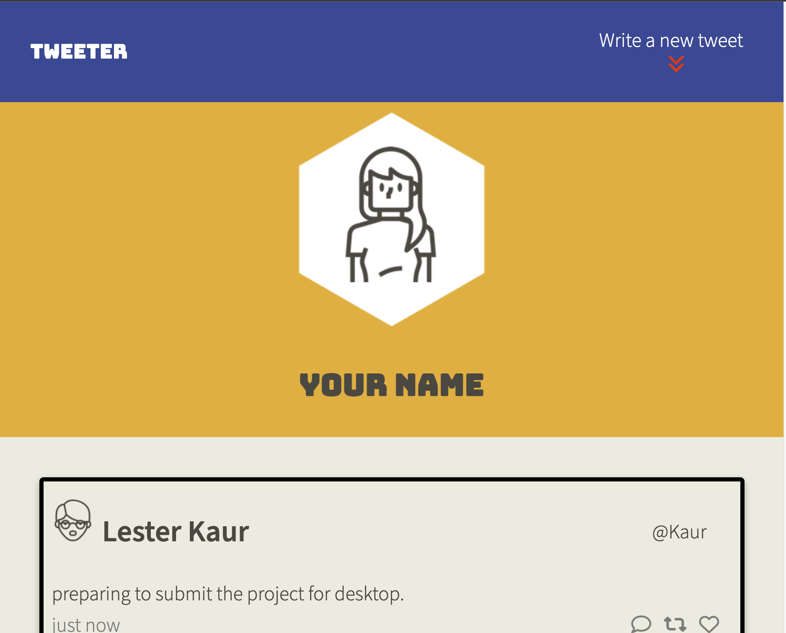
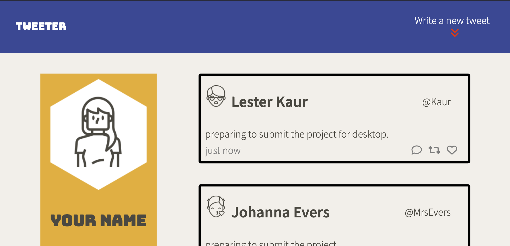
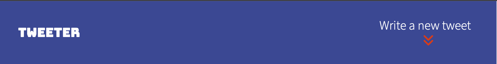
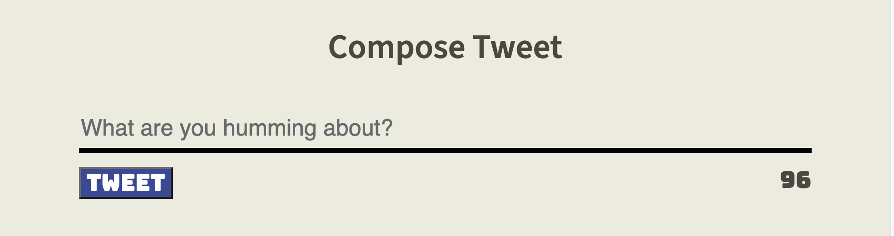
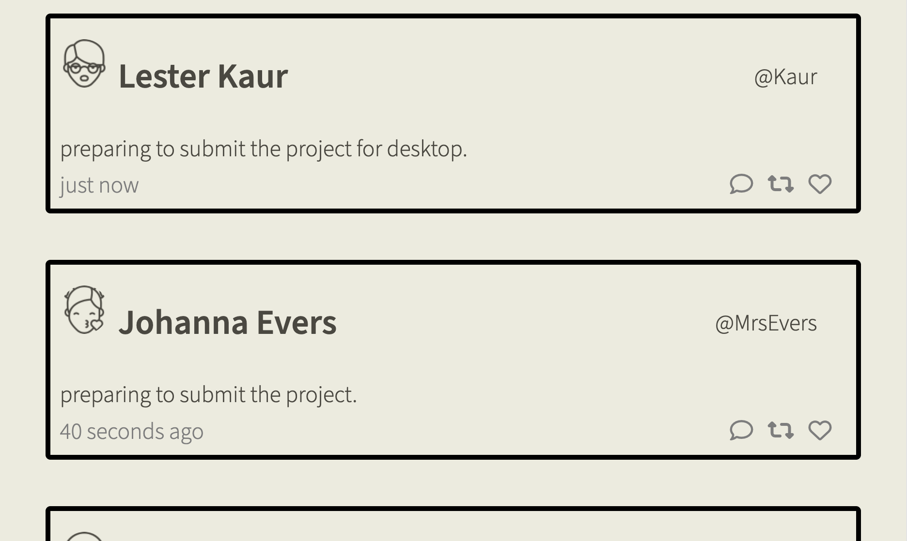

# Tweeter Project - Responsive Web Design

## Overview
Tweeter is not just a Twitter clone; it's a responsive web application that seamlessly adapts to various screen sizes, ensuring an optimal user experience across devices. Built with HTML, CSS (utilizing SASS for styling), JS, jQuery, and AJAX, Tweeter maintains its functionality while providing a visually pleasing and accessible design on both desktop and mobile platforms.  

## Features

### Basic Features

* **Single Page App (SPA):** Tweeter is designed as a Single Page App, ensuring a seamless and dynamic user experience without the need for page reloads.
* **AJAX Communications:** The application communicates with a server via AJAX, enabling real-time updates without refreshing the entire page.

### User Interface
* **Navigation Bar**  

* **Compose Tweet Box**  

* **List of Tweets**  

### Stretch Features
* Navigation Bar Animation  
Smooth Transitions: The animated transitions between the 'shown' and 'hidden' states of the Compose Tweet box are optimized for responsiveness.
* Second Toggle Button  
Mobile Compatibility: The scroll-to-top feature seamlessly integrates with the mobile experience, offering a smooth return to the top of the page.

## Implementation Details
* **Responsive Styles:** SASS is utilized to implement responsive styles, ensuring a consistent look and feel across devices.
* **Mobile-First Approach:** The design follows a mobile-first approach, progressively enhancing features for larger screens.

## Dependencies

- Express
- Node 5.10.x or above
- SASS
- body-parser
- chance